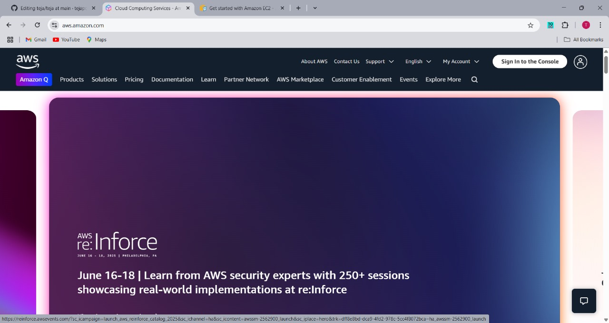
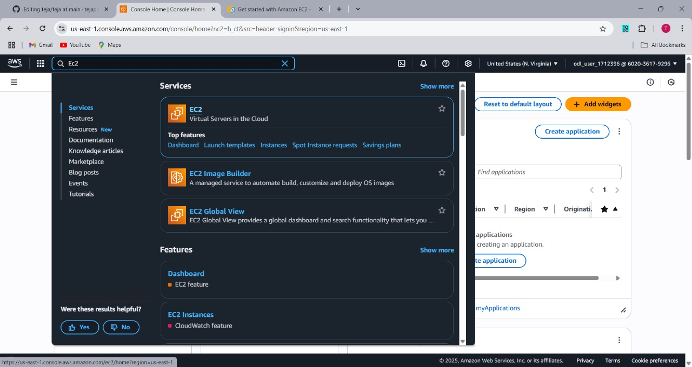
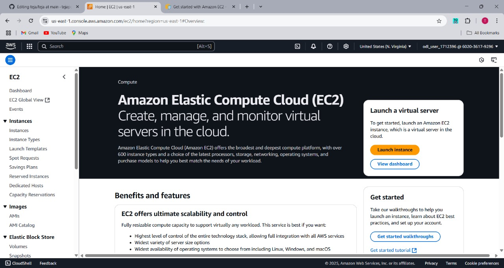
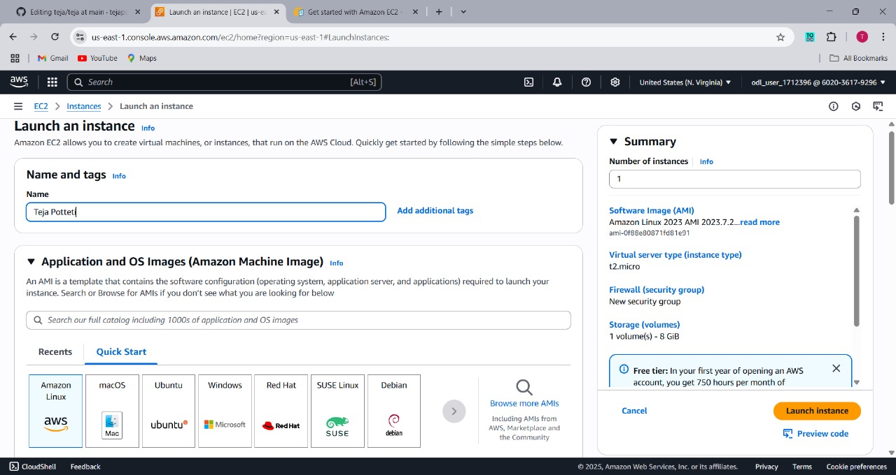
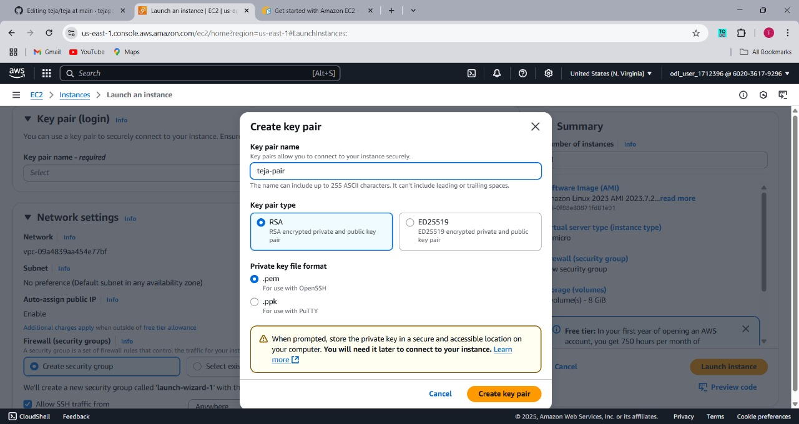
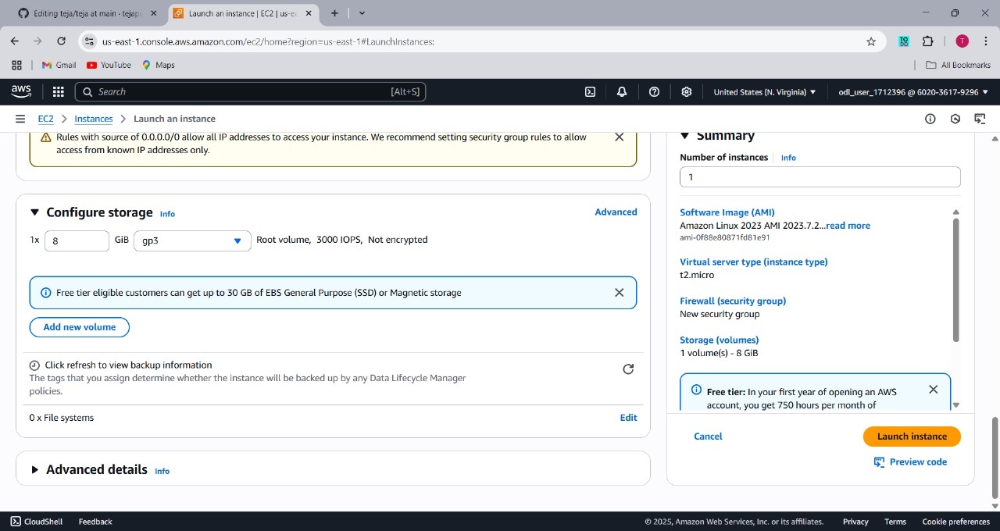

# ☁️ Lab Guide: Creating an EC2 Instance on AWS

---

## 🎯 Objective

In this lab, we will walk through the process of creating an EC2 (Elastic Compute Cloud) instance on Amazon Web Services (AWS). EC2 instances are virtual servers that allow you to run applications, host websites, and much more in the cloud. By following this guide, you'll understand how to:

- Launch an EC2 instance
- Configure the instance settings
- Connect to the instance via SSH
- Test your connection and run basic commands

---

## 🧰 Tools and Requirements

Before beginning, ensure you have the following:

- **AWS Free-Tier Account:** If you don't have an account, sign up at [AWS Free Tier](https://aws.amazon.com/free/).
- **Web Browser**: Chrome, Firefox, Safari, or Edge will work.
- **Internet Connection**: An active connection is required to access the AWS Management Console.
- **Basic Knowledge of Linux** (optional): We will be using Amazon Linux or Ubuntu, and basic commands will be used.

---

## 🛠️ Step 1: Sign In to AWS Management Console

The first step is to log in to the AWS Console, where you’ll have access to EC2 and other AWS services.

1. Go to [AWS](https://aws.amazon.com) and click on **"Sign in to the Console"** in the top right.
2. If you have an AWS account, use your root account credentials or IAM (Identity and Access Management) user credentials.
3. If you don't have an account, you'll need to create one. Once created, proceed to log in.

> **Tip**: AWS provides a **Free Tier** for new users, allowing you to use certain services at no cost for the first 12 months, including EC2 t2.micro instances.

<p align="center">
  
</p>

---

## 📍 Step 2: Navigate to EC2 Dashboard

Now that you're logged in, we need to access the EC2 dashboard to create and manage instances.

1. On the AWS Console homepage, locate the **search bar** at the top.
2. Type `EC2` in the search bar and click on the **EC2** link from the dropdown that appears.

> The EC2 dashboard is the control center for managing your virtual servers. Here you can launch instances, configure security, set up storage, and more.

<p align="center">
  
</p>

---

## 🚀 Step 3: Launch a New Instance

In this step, we will configure the settings for your new EC2 instance.

1. Click on the **Launch Instance** button on the EC2 dashboard. This will open the instance creation wizard.
2. In the **Name and tags** section, give your instance a name, like `MyLinuxServer`. This will help you identify the instance later.
3. Under **Application and OS Images (AMI)**, you can choose from various operating systems. For this lab, we will select **Amazon Linux 2023 AMI** or **Ubuntu**.
4. In the **Instance Type** section, select `t2.micro`, which is eligible for the Free Tier (providing 1 vCPU and 1 GB of RAM).
   - **Tip**: The `t2.micro` instance type is great for lightweight applications and is free for up to 750 hours per month.

> **Explanation**: AMI (Amazon Machine Image) is the image or template for the operating system, and Instance Type determines the hardware configuration of your EC2 server.

<p align="center">
  
</p>

In the **Name and tags** section, give your instance a name, like `Teja Potteti`.

<p align="center">
  
</p>

---

## 🔐 Step 4: Create or Select a Key Pair

For security reasons, you need a key pair to SSH into your EC2 instance. A key pair consists of a private key (stored on your computer) and a public key (stored in AWS).

1. In the **Key pair (login)** section, select **Create a new key pair**.
2. Give it a name, like `my-key`.
3. Choose `.pem` format (for Linux/Mac) or `.ppk` format (for Windows/Putty).
4. Click **Download Key Pair** to download the private key file to your computer. Keep it safe, as this is your only way to access the EC2 instance.

> **Note**: The `.pem` file is a **one-time download**. You won’t be able to download it again, so store it securely.

<p align="center">
  
</p>

---

## 🌐 Step 5: Configure Network Settings

1. AWS automatically creates a default security group that allows SSH access (port 22). Ensure you allow SSH access from your IP address.
2. Click **Edit inbound rules** to make sure that **SSH (port 22)** is allowed from **My IP** only for security.

> **Security Tip**: Allowing SSH access from "Anywhere" (`0.0.0.0/0`) is a security risk, as it opens your server to the internet. Always restrict access to specific IP addresses when possible.

<p align="center">
  
</p>

3. Optionally, you can also enable **HTTP (port 80)** if you plan to host a web server or access the instance via a browser.

<p align="center">
  
</p>


---

## 📦 Step 6: Configure Storage

The default storage size is usually sufficient for a basic instance (8 GB). However, if you need more storage or want to use SSD for better performance, you can change this here.

1. By default, an **8 GB SSD (gp2)** is allocated to the instance. You can increase this size if needed.
2. Click **Next** to continue.

> **Tip**: SSDs (Solid State Drives) provide faster read/write performance compared to HDDs (Hard Disk Drives), so they are preferred for performance-critical applications.

<p align="center">
  
</p>

---

## 🚨 Step 7: Launch Instance

1. After reviewing all the configurations (like instance type, AMI, storage), click **Launch Instance**.
2. After the instance is launched, click **View Instances** to go to the Instances page.

> **Tip**: Launching your instance can take a few minutes. Once it’s ready, it will show a status of **Running**.

<p align="center">
  
</p>

---

## ✅ Step 8: Verify the Instance Status

Once the instance is launched, you need to verify that it’s running and healthy:

1. In the **Instances** section of the EC2 dashboard, you will see your new instance listed with the following details:
   - **Status**: Running
   - **Public IP address**: You’ll need this IP to connect via SSH
   - **Instance State**: 2/2 status checks passed

> **Tip**: The **Public IP** is the address you will use to SSH into your instance. Note this down.

<p align="center">
  
</p>

---

## 💻 Step 9: Connect to EC2 Instance (Linux/Mac)

To connect to the EC2 instance via SSH, follow these steps:

1. Open a terminal (Linux/Mac).
2. Change the permissions of your private key file:

   ```bash
   chmod 400 my-key.pem
